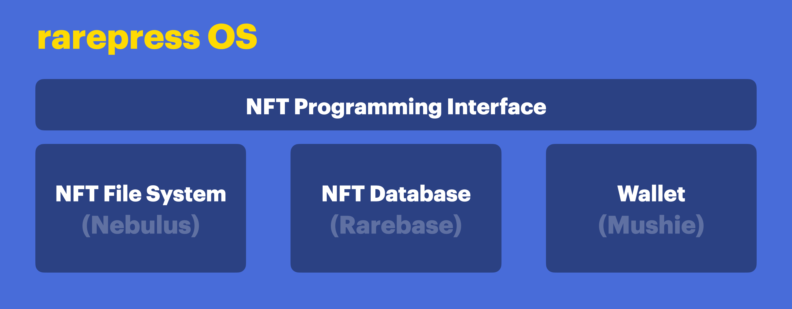

<header>
  <a href="https://rarepress.org">Home</a>
  <a href="https://twitter.com/skogard">Twitter</a>
  <a href="https://github.com/rarepress">GitHub</a>
  <a href="https://discord.gg/BZtp5F6QQM">Discord</a>
</header>

> Legacy v0 endpoint docs: https://docs.rarepress.org
>
> Examples and tutorials: https://examples.rarepress.org
>
> API reference: https://api.rarepress.org
>
> Rarenet documentation: https://rarenet.rarepress.org


# Rarepress OS



Rarepress is an open source framework that makes it easy to mint, trade and manage NFTs, as well as build NFT powered apps and engines. It ships with:

1. **NFT File System:** An NFT File System that seamlessly integrates with IPFS.
2. **NFT Database:** An NFT Database that lets you store and query tokens and trade objects.
3. **NFT Programming Interface:** JavaScript based API for interacting with the Rarible protocol, the file system, and the database..
4. **Admin Wallet:** A built-in admin wallet.


> Rarepress OS GitHub Repository: https://github.com/rarepress/rarepress

---

# Quickstart

Using the rarepress OS directly using the `rarepress` module is the simplest way to get started, since it doesn't require any 3rd party dependency.

So let's start with that.

Let's first create a project:

```
mkdir local-nft
cd local-nft
npm init
```

Next, install `rarepress`:

```
npm install rarepress
```

Now lets write some code. Create a file named `app.js`:

```javascript
const Rarepress = require('rarepress');
(async () => {
  // 1. initialize
  const rarepress = new Rarepress()
  await rarepress.init({ network: "mainnet" });
  // 2. import a web image to fs
  let cid = await rarepress.fs.add("https://thisartworkdoesnotexist.com")
  // 3. create a token and save to local rarepress, referencing the image
  let signedToken = await rarepress.token.create({
    type: "ERC721",
    metadata: {
      name: "😎",
      description: "sunglasses",
      image: "/ipfs/" + cid
    },
  })
  console.log("signedToken", signedToken)

  // 4. publish the image file to IPFS
  await rarepress.fs.push(cid)
  // 5. publish the metadata file to IPFS
  await rarepress.fs.push(signedToken.tokenURI)

  // 6. publish the signed token to rarible
  let sent = await rarepress.token.send(signedToken)
  console.log("# SENT", sent)
  console.log(`Check your token at: https://rarible.com/token/${sent.id}`)

  // 7. Exit the program
  process.exit()
})();
```

Now run it:

```
node app
```

When you first execute the code, the built-in wallet will ask you to generate a seed (you can import a seed later too). The encrypted seed will be stored at path: `~/.mushie`.

Once you generate the seed, it will run the code and the token will be minted.

It will print the token object as well as the Rarible.com endpoint where you can check the token, something like this:

```
...
Check your token at: https://rarible.com/token/...
```

Go check the token page on rarible and you'll see it's there!

---

# API Reference

> For a full API reference,
>
> visit https://api.rarepress.org

---

# Examples

> For tutorials and examples,
>
> visit https://examples.rarepress.org

---


# Install

Rarepress is the core operating system that includes a file system, database, wallet, and the application programming interface.

You can embed it into any node.js project using:

```
npm install rarepress
```

The project is open sourced at: https://github.com/rarepress/rarepress

---
